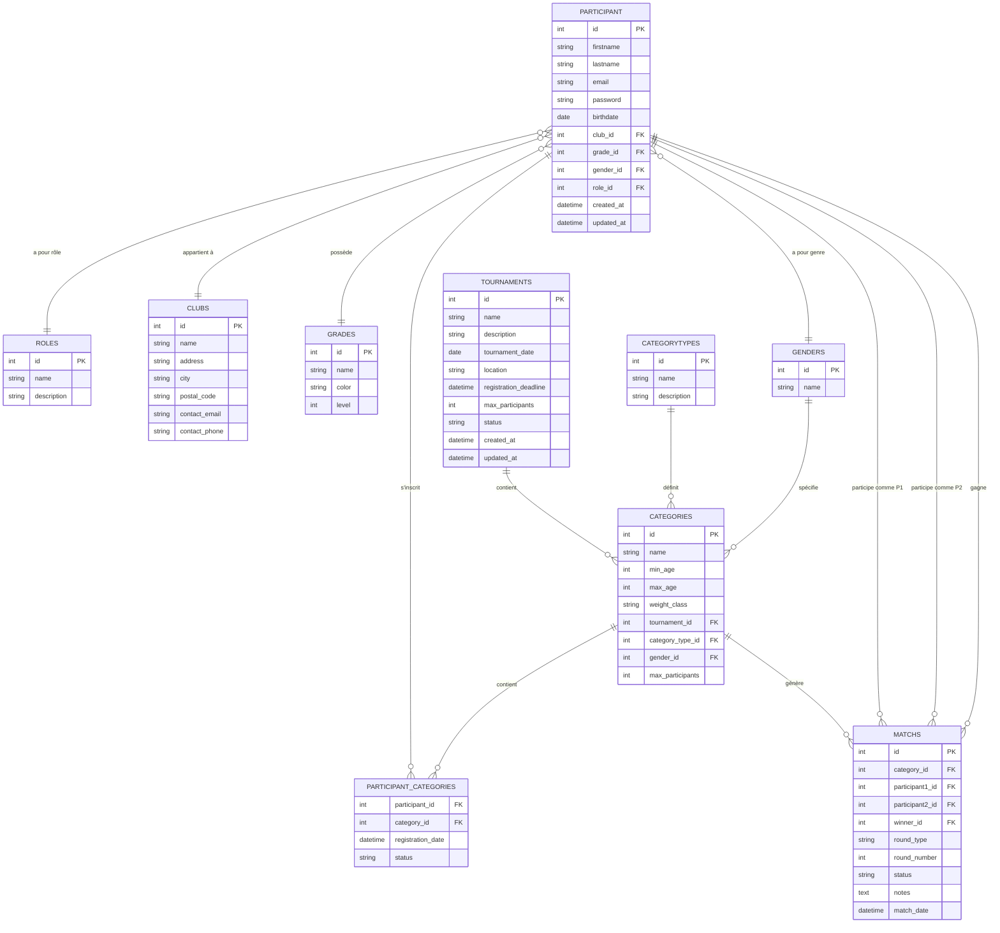

# Système de Gestion des Tournois de Nippon Kempo


## 📋 Présentation

Ce projet est composé de quatre parties complémentaires :

1. **Site Web Public (Frontend)** : Interface Quasar/Vue.js permettant aux utilisateurs de consulter le calendrier des événements, de s'inscrire aux compétitions et de suivre leurs résultats en ligne.

2. **API Backend** : Service Fastify/Node.js gérant toute la logique métier, l'authentification et les interactions avec la base de données.

3. **Base de données MySQL** : Stockage relationnel de toutes les données (tournois, participants, résultats, clubs, etc.).

4. **Back Office Individuel** : Application Electron avec des fonctionnalités de gestion avancées, incluant un système de connexion et un gestionnaire de club avec synchronisation Replicache.

En savoir plus sur le projet collaboratif : https://github.com/Orkhyd/CESI-Local-NK-Tournament

## ✨ Fonctionnalités

- **Gestion des tournois** : Calendrier des compétitions, détails des événements
- **Système d'inscription** : Inscription du participant connecté à différents tournois et catégories
- **Suivi des résultats** : Historique des résultats et gagnants de chaque tournoi, catégorie et club
- **Espace personnel** : Historique des participations et performances individuelles
- **Statistiques** : Visualisation des données et analyse des compétitions

## 🛠️ Technologies

### Frontend
- **Framework** : Vue.js 3 avec Composition API
- **UI Framework** : Quasar Framework
- **Styling** : CSS/SCSS

### Backend
- **Runtime** : Node.js
- **Framework** : Fastify
- **Base de données** : MySQL (avec librairie mysql2)
- **Authentication** : JWT (JSON Web Tokens)
- **Mailing** : Mailjet avec API et email professionnel

### Back-office
- **Framework** : Electron avec Vue.js 3
- **State Management** : Pinia
- **Synchronisation** : Replicache
- **Authentication** : JWT (JSON Web Tokens)

### Déploiement
- **Hébergement Frontend & API** : Render
- **Base de données** : Railway (MySQL hébergé)
- **Conteneurisation** : Docker et Docker Compose
- **CI/CD** : GitHub Actions avec déploiement automatique

## 🚀 Installation

### Prérequis
- Node.js (v16 ou supérieur)
- Docker et Docker Compose
- Git

### Étapes d'installation

1. **Cloner le dépôt**
   ```bash
   git clone https://github.com/Pierre542A/nippon-kempo-tournament-individual.git
   cd nippon-kempo-tournament-individual
   ```

2. **Configuration des variables d'environnement**
   
   Créez un fichier `.env` à la racine du projet avec les variables suivantes :
   ```env
   # Base de données locale (Docker)
   MYSQL_HOST=mysql-bdd
   MYSQL_USER=user
   MYSQL_ROOT_PASSWORD=rootpassword
   MYSQL_PASSWORD=password
   MYSQL_DATABASE=mydatabase_nippon_kempo_project
   
   # Environnement
   NODE_ENV=development
   
   # JWT & Sécurité
   JWT_SECRET=test
   COOKIE_SECRET=a-secret-with-at-least-32-characters
   
   # API URL (pour le front)
   VITE_API_URL=http://localhost:3000
   
   # Mailjet (pour l'envoi de mails)
   MJ_APIKEY_PUBLIC=bcf15c6b66dc91b906cf73c904da0fdd
   MJ_APIKEY_PRIVATE=159499a6b3db43bc7d2fcaa41f57845b
   ```

   Créez un second fichier `.env` dans le dossier `back-individuel/` avec :
   ```env
   VITE_APP_MDP=motdepasse
   VITE_REPLICACHE_LICENSE_KEY=l70ce33fc0dee46abb6f056086da4d87259499a6b3db43bc7d2fcaa41f57845b
   ```

3. **Lancement**
   ```bash
   # Assurez-vous que Docker est en cours d'exécution
   # Puis lancez le fichier start.bat (Windows)
   start.bat
   ```

## 🗄️ Modèle Conceptuel de Données (MCD)



## 📁 Structure du projet

```
nippon-kempo-tournament-individual/
├── api/                           # API Backend avec Fastify
│   ├── routes/                    # Définition des routes API
│   ├── controllers/               # Contrôleurs pour la logique métier
│   ├── services/                  # Services partagés
│   ├── middleware/                # Middleware d'authentification
│   ├── Dockerfile                 # Configuration Docker pour l'API
│   ├── package.json               # Dépendances de l'API
│   └── server.js                  # Point d'entrée de l'API
│
├── bdd-mysql2/                    # Base de données MySQL
│   ├── table_categories.sql       # Structure table des catégories
│   ├── table_categorytypes.sql    # Structure table des types de catégories
│   ├── table_clubs.sql            # Structure table des clubs
│   ├── table_genders.sql          # Structure table des genres
│   ├── table_grades.sql           # Structure table des grades
│   ├── table_matchs.sql           # Structure table des matchs
│   ├── table_participant.sql      # Structure table des participants
│   ├── table_roles.sql            # Structure table des rôles utilisateurs
│   ├── table_tournaments.sql      # Structure table des tournois
│   └── ykeys_foreign.sql          # Clés étrangères et contraintes
│
├── back-individuel/               # Application Electron (back-office)
│   ├── electron/                  # Configuration Electron
│   ├── src/                       # Code source
│   ├── public/                    # Ressources statiques
│   ├── .env                       # Variables d'environnement spécifiques
│   └── [autres fichiers]          # Autres fichiers du back-office
│
├── front-quasar/                  # Frontend avec Quasar/Vue.js
│   ├── src/
│   │   ├── assets/                # Images, polices et autres ressources
│   │   ├── boot/                  # Scripts d'initialisation Quasar
│   │   ├── css/                   # Fichiers CSS/SCSS
│   │   ├── layouts/               # Mises en page de l'application
│   │   ├── pages/                 # Pages de l'application
│   │   ├── router/                # Configuration des routes
│   │   ├── store/                 # Magasins Pinia
│   │   ├── App.vue                # Composant racine
│   │   └── app.d.ts               # Déclarations TypeScript
│   │
│   ├── public/                    # Fichiers statiques
│   └── quasar.conf.js             # Configuration Quasar
│
├── .editorconfig                  # Configuration de l'éditeur
├── .gitattributes                 # Attributs Git
├── .gitignore                     # Fichiers ignorés par Git
├── .prettierrc.json               # Configuration Prettier
├── README.md                      # Documentation du projet
├── eslint.config.js               # Configuration ESLint
├── index.html                     # Page HTML principale
├── jsconfig.json                  # Configuration JavaScript
├── package-lock.json              # Verrouillage des versions de dépendances
├── package.json                   # Dépendances du projet
├── .env                           # Variables d'environnement générales
├── docker-compose.yml             # Configuration Docker Compose
└── start.bat                      # Script de démarrage pour Windows
```

## 👥 Rôles utilisateurs

| Rôle | Permissions |
|------|-------------|
| **Visiteur** | Consultation du calendrier, visualisation des résultats publics |
| **Utilisateur** | Inscription aux tournois, gestion du profil, consultation des résultats personnels |
| **Gestionnaire** | Administration des compétitions, gestion des participants |
| **Administrateur** | Gestion complète des tournois, des utilisateurs et de la plateforme |

## 🧪 Tests

Les commandes suivantes sont disponibles pour les tests, mais leur configuration spécifique peut nécessiter des ajustements :

```bash
# Exécuter les tests unitaires
npm run test

# Exécuter les tests end-to-end
npm run test:e2e
```

> Note: La configuration des tests peut nécessiter une adaptation en fonction de l'environnement.

## 📱 Compatibilité

- Navigateurs modernes (Chrome, Firefox, Safari, Edge)
- Design responsive pour mobile, tablette et desktop

## 🚀 Déploiement

Le projet est déployé avec l'architecture suivante :
- **Frontend** : Render (Static Site)
- **API** : Render (Web Service)
- **Base de données** : Railway (MySQL hébergé)
- **CI/CD** : Déploiement automatique via GitHub

URLs de production :
- Site web : [URL du site déployé]
- API : [URL de l'API déployée]

## 📞 Contact

**SPREDER Pierre**  
Projet CESI École d'ingénieurs  
NIPPON KEMPO 2025

---

&copy; 2025 Pierre SPREDER | Tous droits réservés